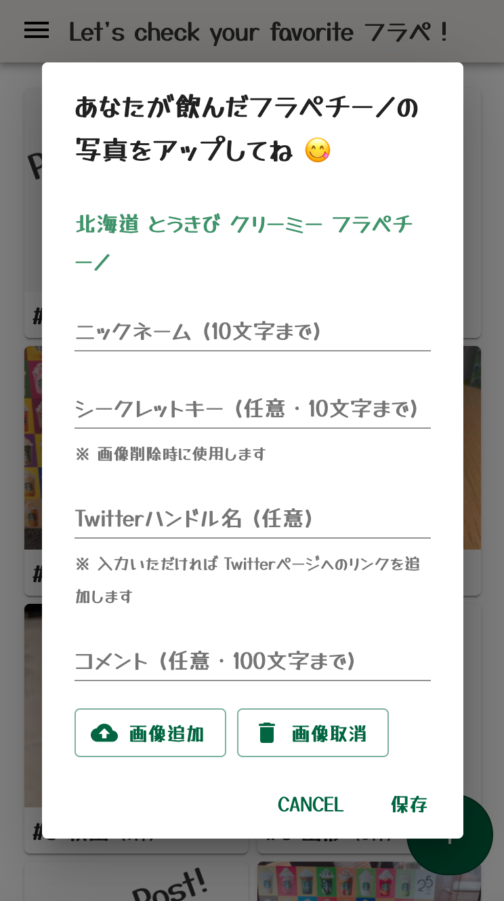

# STARBUCKS 47 JIMOTO Frappuccino 投稿サイト
[sbux-47pref.surge.sh](https://sbux-47pref.surge.sh/)  

  

# このリポジトリについて / About
2021年6月30日から8月3日までの期間限定で始まった [STARBUCKS JAPAN 47JIMOTO フラペチーノ](https://www.starbucks.co.jp/cafe/jimoto_frappuccino/)  
このフラペチーノの画像を投稿するサイトの **フロントエンド** のリポジトリです。  

▶️ 管理用メインリポジトリは [こちら](https://github.com/nouvelle/sbux-47pref)  
▶️ バックエンドは [こちら](https://github.com/nouvelle/sbux-47pref-back)  

# 構成 / Architecture


# 開発方法 / Development
## バックエンドの URL 設定 (`/src/config.js`)
`production` には本番環境、 `development` には開発環境のバックエンドの URL を定義してください。

```js
const config = {
  production: {
    host: "https://sbux-47pref-back.onrender.com",
  },
  development: {
    host: "http://localhost:5001",
  },
};

export default config;
```

## 起動方法
```bash
# 1. このリポジトリを clone する
$ git clone https://github.com/nouvelle/sbux-47pref-front

# 2. clone したリポジトリに移動する
$ cd sbux-47pref-front

# 3. パッケージをインストールする
$ npm i

# 4. アプリを起動する
$ npm run start
```

# コントリビューション / Contributing
みなさんからの Issues & Pull requests 大歓迎です！ 😊

## Issue レポート
バグ報告、新規機能の要望やご提案など、[当リポジトリの Issues](https://github.com/nouvelle/sbux-47pref-front/issues) をご活用ください。

## Pull Request(PR)
PR は、個別のブランチを切って作業してください。原則、PRは main ブランチを対象としてください。


# ライセンス / License
[MIT](https://choosealicense.com/licenses/mit/)
